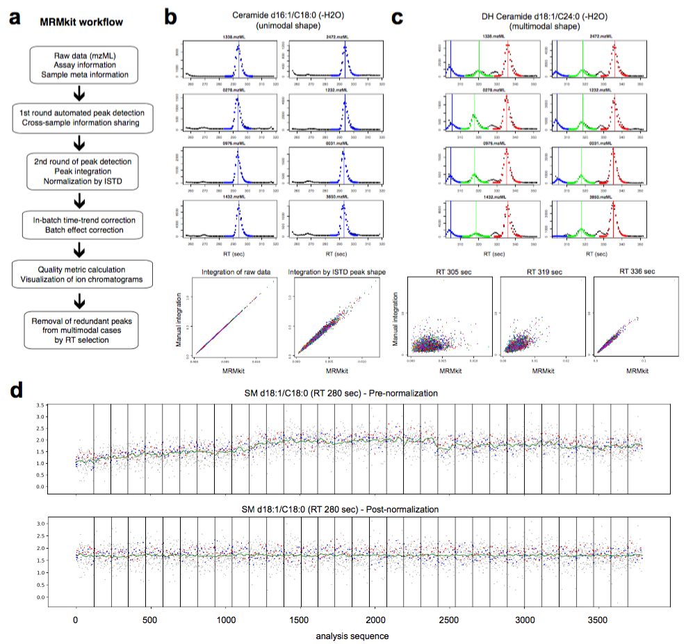

# MRMkit

## MRMkit: automated data processing for large-scale targeted mass spectrometry
 

See the [manual](manual.pdf) for full documentation.

## Installing 

### Unix

Installation of [python3](https://www.python.org/) (>=3.7), SciPy, Matplotlib and [R](https://cran.r-project.org/) (>=4.0) is required. See [commands.md](commands.md) for usage.

### Windows

Installation of [R](https://cran.r-project.org/) (>=4.0) is required.
Executables for 64-bit Windows are included [here](https://drive.google.com/drive/folders/1Jt2cRt96Jez4uTZUGN-gaXrD67MWvbMK?usp=sharing).

## Example dataset

An example dataset [here](https://drive.google.com/drive/folders/18VtbYfto3sXIJfTpOUetuunyraTCyqdf).

## Bugs and Feedback

For bugs, questions and discussions please use the [GitHub Issues](https://github.com/MRMkit/MRMkit/issues).

