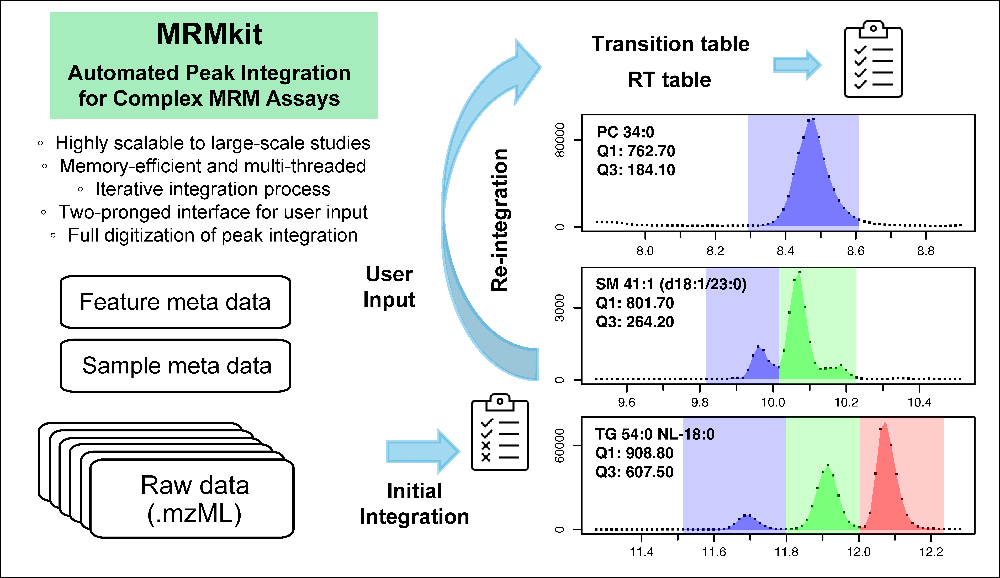

# ⚠️ This Repository Has Moved ⚠️
This repository is now archived and is no longer maintained.

All development, issues, and discussions have been moved to a new location. Please update your bookmarks and use the new repository for all future contributions and inquiries.

You can find the new repository at the following URL:

## ➡️ https://github.com/SLINGhub/MRMhub ⬅️

<!--

# MRMkit

## MRMkit: automated data processing for large-scale targeted mass spectrometry
 

## Windows

Executables for 64-bit Windows are included [here](https://github.com/MRMkit/MRMkit/releases/latest).

## Example dataset

An example dataset [here](https://drive.google.com/drive/folders/18VtbYfto3sXIJfTpOUetuunyraTCyqdf).

## How to cite
- Teo G, Chew WS, Burla BJ, Herr D, Tai ES, Wenk MR, Torta F, Choi H. MRMkit: Automated Data Processing for Large-Scale Targeted Metabolomics Analysis. Anal Chem. 2020 Oct 20;92(20):13677-13682. doi: 10.1021/acs.analchem.0c03060. Epub 2020 Sep 28. PMID: 32930575.

## Bugs and Feedback

For bugs, questions and discussions please use the [GitHub Issues](https://github.com/MRMkit/MRMkit/issues).

